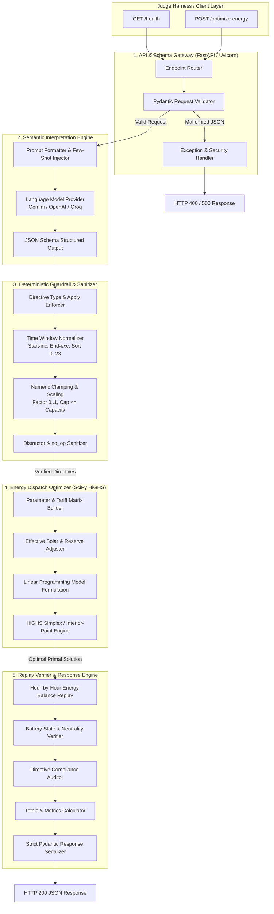

# GridWise LLM — System Architecture Specification

## 1. Executive Summary & Objective

**GridWise LLM** is an intelligent microgrid optimization service built for the BUP CSE FEST 2026 Hackathon. The service ingests 24-hour campus energy forecasts (demand, solar, tariff), battery parameters, and free-form natural language operator notes. It outputs a verified structured interpretation of the notes and a cost-minimized, mathematically optimal 24-hour battery scheduling plan that satisfies all electrical, thermal, and directive constraints.

### The Canonical Philosophy
> **"Human notes are never directly trusted as math."**  
> Natural language is inherently ambiguous, variable, and unverified. GridWise LLM isolates the generative model to semantic directive extraction, passes its output through a deterministic guardrail and normalization boundary, and passes only mathematically verified constraints to a high-speed linear programming (LP) solver.

---

## 2. Core Architectural Principles

1. **Strict Separation of Concerns**:
   - **LLM Engine**: Extracts human intent into predefined JSON schemas.
   - **Deterministic Guardrails**: Validates, normalizes, sorts, clamps, and defaults untrusted model outputs.
   - **Operations Research Solver**: Computes mathematically optimal dispatch plans in $<5\text{ms}$.
   - **Replay Verifier**: Independently audits the final plan before serialization.
2. **Zero-Database Statelessness**:
   - Every request is atomic and self-contained.
   - No external database dependencies, preventing connection drops, migration locks, or startup delays during judge evaluation.
3. **Deterministic Failure Containment**:
   - Malformed operator notes or LLM network interruptions trigger safe fallbacks (`no_op` classification) rather than crashing the HTTP worker.
   - Zero stack traces or API keys are ever leaked in API responses, logs, or error payloads.
4. **Sub-5-Second Latency Budget ($p95 \le 5.0\text{s}$)**:
   - Optimized connection pools, lightweight LLM payloads with JSON schema enforcement, and sub-millisecond HiGHS solver runs guarantee maximum points in performance evaluation.

---

## 3. High-Level System Architecture



---

## 4. Detailed Component Breakdown

### 4.1 API & Ingestion Layer
- **Framework**: Python 3.11+ / FastAPI with `uvicorn` ASGI server.
- **Role**:
  - Exposes `GET /health` and `POST /optimize-energy`.
  - Performs initial structural validation using Pydantic models (verifies exactly 24 hourly entries, non-empty operator notes, battery physical parameters).
  - Normalizes unexpected JSON exceptions into standard HTTP 400 responses.
  - Masks internal errors into clean HTTP 500 responses without leaking file paths or credentials.

### 4.2 LLM Semantic Interpretation Engine
- **Role**: Understands natural language operator notes and maps each note $i \in \{0, \dots, N-1\}$ to exactly one directive type or `no_op`.
- **Supported Directive Enums**:
  1. `solar_reduction`: `{"hours": [int, ...], "factor": float}`
  2. `minimum_battery_reserve`: `{"hours": [int, ...], "minimum_energy_kwh": float}`
  3. `no_charge_window`: `{"hours": [int, ...]}`
  4. `no_discharge_window`: `{"hours": [int, ...]}`
  5. `max_grid_window`: `{"hours": [int, ...], "max_grid_kwh": float}`
  6. `no_op`: `null`
- **Prompt Strategy**:
  - System prompt establishes expert microgrid operator persona.
  - Injects few-shot canonical examples demonstrating edge cases (e.g., "80% reduction" $\rightarrow$ factor $0.2$, "50% capacity stored" $\rightarrow 0.5 \times \text{capacity}$, "1 PM to 3 PM" $\rightarrow [13, 14]$).
  - Native JSON schema mode enforces valid JSON generation.
- **Provider Redundancy & Fallback**:
  - Primary provider (e.g. Gemini 2.5 Flash / Groq Llama 3.3 70B / OpenAI GPT-4o-mini).
  - Timeout threshold: 4.0 seconds per call.
  - Safe failure mode: If the model times out or returns unparseable garbage, fallback parser flags unparsed notes as `no_op` with `applies=False`, preventing service termination.

### 4.3 Deterministic Guardrail & Sanitizer
- **Role**: Hard gate between probabilistic text generation and the mathematical solver.
- **Enforced Rules**:
  1. **Strict 1-to-1 Mapping**: Returns exactly $N$ entries matching the input `note_index` sequence $0, \dots, N-1$.
  2. **Applies Consistency**:
     - If `directive_type == "no_op"`: forces `applies = False` and `structured_adjustment = None`.
     - If `directive_type != "no_op"`: forces `applies = True`.
  3. **Hour Sorting & Range Validation**:
     - Filters hours to integers $\in [0, 23]$.
     - Deduplicates and sorts in strict ascending order.
     - Empty hour lists default the directive to `no_op`.
  4. **Value Bounds & Clamping**:
     - `solar_reduction.factor`: Clamped to $[0.0, 1.0]$.
     - `minimum_battery_reserve.minimum_energy_kwh`: Clamped to $[\text{base\_min}, \text{capacity\_kwh}]$.
     - `max_grid_window.max_grid_kwh`: Enforced $\ge 0.0$.

### 4.4 Operations Research Optimizer (SciPy HiGHS)
- **Model Type**: Continuous Linear Programming (LP).
- **Solver**: `scipy.optimize.linprog(method='highs')`.
- **Variables** (24 hours, $h \in [0, 23]$):
  - $g_h \ge 0$: Grid electricity import (kWh).
  - $s_h \ge 0$: Solar energy utilized (kWh).
  - $c_h \ge 0$: Energy charged into battery (kWh).
  - $d_h \ge 0$: Energy discharged from battery (kWh).
  - $E_h \ge 0$: Battery energy level at end of hour $h$ (kWh).
- **Objective Function**:
  $$\min \sum_{h=0}^{23} \left( g_h \cdot \text{tariff}_h + \epsilon (c_h + d_h) \right)$$
  *(where $\epsilon = 10^{-6}$ ensures charge/discharge complementarity and battery throughput minimization in degenerate zero-tariff hours)*.
- **Linear Constraints**:
  1. *Energy Balance*: $g_h + s_h + d_h - c_h = \text{demand}_h$
  2. *Solar Availability*: $0 \le s_h \le \text{effective\_solar}_h$
  3. *State Update ($h=0$)*: $E_0 - c_0 + d_0 = E_{\text{initial}}$
  4. *State Update ($h \ge 1$)*: $E_h - E_{h-1} - c_h + d_h = 0$
  5. *Battery Capacity & Reserve*: $\text{active\_reserve}_h \le E_h \le \text{capacity}$
  6. *Rate Limits*: $0 \le c_h \le \overline{C}_h$, $0 \le d_h \le \overline{D}_h$
  7. *Grid Cap*: $0 \le g_h \le \overline{G}_h$
  8. *End-of-Day Neutrality*: $E_{23} = E_{\text{initial}}$

### 4.5 Replay Verifier & Response Formatter
- **Role**: Re-simulates the resulting `hourly_plan` against raw physical and operational equations before the response leaves the service.
- **Verification Checks**:
  - Re-evaluates $\text{effective\_solar}_h$ and checks $s_h \le \text{effective\_solar}_h + 10^{-4}$.
  - Computes cumulative $E_h$ step-by-step from $E_{\text{initial}}$ to verify state transitions.
  - Asserts $E_h \ge \text{active\_reserve}_h - 10^{-4}$ and $E_{23} \approx E_{\text{initial}}$.
  - Checks charge action mutually exclusive with discharge action.
  - Recalculates `total_grid_kwh`, `total_cost_bdt`, and `peak_grid_kwh` to ensure zero internal arithmetic discrepancy.

---

## 5. Non-Functional Requirements & Performance Budgets

| Metric | Requirement / Target | Strategy |
|---|---|---|
| **$p95$ Latency** | $\le 5.0\text{s}$ (3/3 pts) | Model streaming/fast structured outputs, lightweight prompt, sub-millisecond HiGHS LP solver |
| **Max Timeout** | $< 30.0\text{s}$ (Disqualification boundary) | 10s client timeout on LLM request, fallback to local heuristic if network stalls |
| **Throughput** | 10 concurrent requests | Async FastAPI with non-blocking threadpool for CPU-bound LP solving |
| **Memory Footprint** | $< 250\text{ MB}$ | No heavy database daemons, lightweight Python runtime |
| **Secrets Safety** | 0 secrets in logs or payloads | Environment variable injection, Pydantic log redaction |

---

## 6. Deployment & Container Architecture

- **Base Image**: `python:3.11-slim` (minimal attack surface, fast pull time $<25\text{s}$).
- **Port Exposure**: Exposes port `8000`, binds explicitly to `0.0.0.0`.
- **Process Management**: Single worker with `uvicorn` using standard POSIX signal handling (`SIGTERM` / `SIGINT`).
- **Health Probe**: Built-in `GET /health` responds immediately within $<5\text{ms}$ upon container readiness.

```
+-------------------------------------------------------------+
| Container: gridwise-service                                 |
|                                                             |
|   +-----------------------+     +-----------------------+   |
|   |   FastAPI / Uvicorn   | <-> |  SciPy HiGHS Solver   |   |
|   |     (Port 8000)       |     |   (In-Process C++)    |   |
|   +-----------------------+     +-----------------------+   |
|               ^                                             |
|               | (HTTPS outbound)                            |
|               v                                             |
|   +-----------------------+                                 |
|   |  Hosted LLM Gateway   |                                 |
|   +-----------------------+                                 |
+-------------------------------------------------------------+
```
