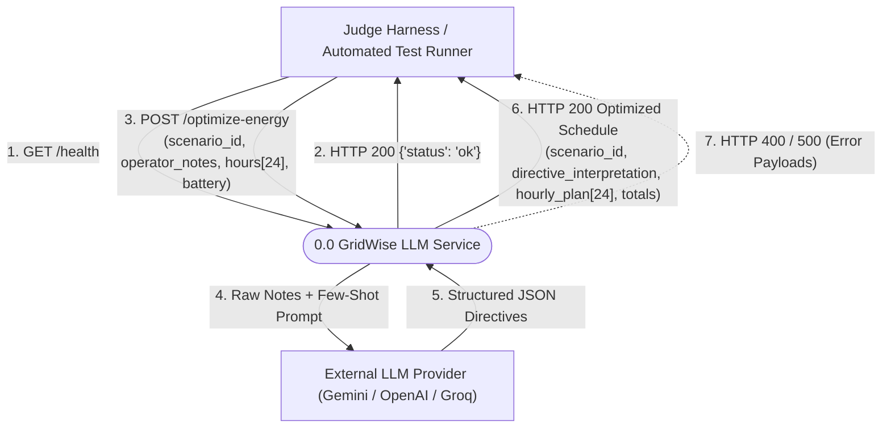
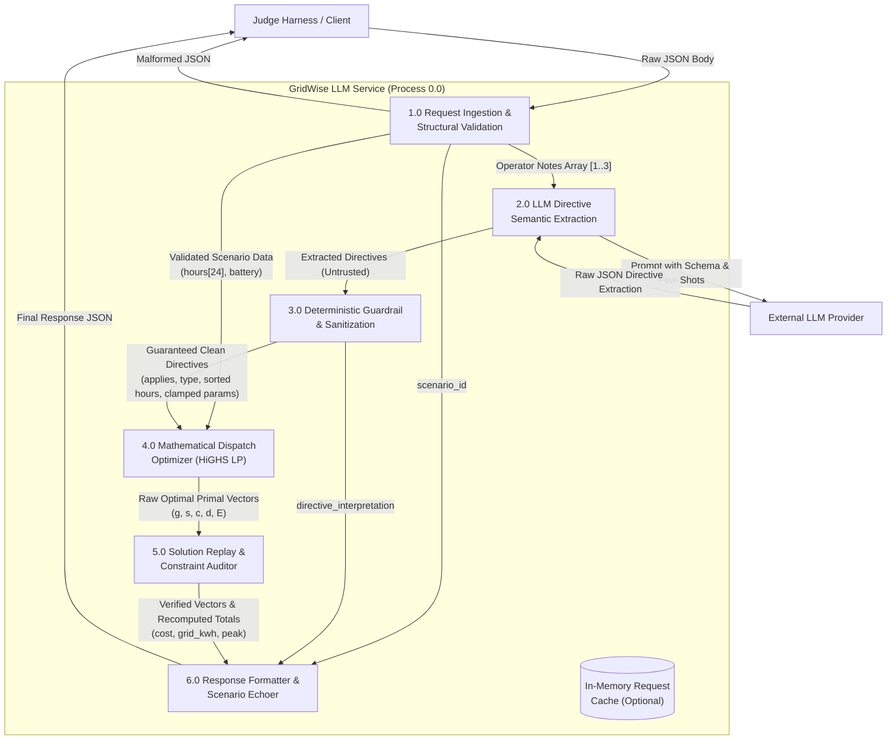
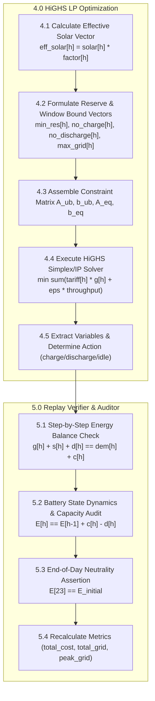

# GridWise LLM — Data Flow Diagram (DFD) Specification

This document provides the formal Data Flow Diagrams (DFD) and Data Dictionary for the GridWise LLM microgrid scheduling service.

---

## 1. DFD Level 0 — System Context Diagram

The Context Diagram defines the external boundaries of the GridWise LLM service, the external entities that interact with it, and the high-level inputs and outputs.



---

## 2. DFD Level 1 — System Decomposition

The Level 1 DFD decomposes the service into its 6 core functional processes, showing the transformation of data from raw request to final verified response.



---

## 3. DFD Level 2 — Sub-Process Decomposition

### 3.1 Sub-Process 2.0 & 3.0: LLM Extraction & Deterministic Guardrails
Shows how untrusted natural language is converted into mathematically rigorous constraints.

```mermaid
flowchart LR
    subgraph Process2 ["2.0 LLM Extraction"]
        P2_1["2.1 System Prompt &\nFew-Shot Builder"] --> P2_2["2.2 Network Call with\nSchema Enforcement"]
        P2_2 --> P2_3["2.3 JSON Syntax &\nStructure Check"]
    end

    subgraph Process3 ["3.0 Deterministic Guardrails"]
        P3_1["3.1 1-to-1 Note\nMapping Enforcer"] --> P3_2["3.2 Applies & Directive\nType Validator"]
        P3_2 --> P3_3["3.3 Time Window Parser &\nHour Range Sorter (0..23)"]
        P3_3 --> P3_4["3.4 Numeric Clamper\n(Factor [0,1], Cap <= BattCap)"]
        P3_4 --> P3_5["3.5 Distractor / Fallback\nSanitizer (no_op)"]
    end

    RawNotes["Raw Operator Notes"] --> P2_1
    P2_3 -- "Untrusted Raw Directives" --> P3_1
    P3_5 --> VerifiedDirectives["Sanitized Directives"]
```



### 3.2 Sub-Process 4.0 & 5.0: Mathematical Optimization & Verification
Shows the translation of sanitized directives into continuous linear program equations and subsequent auditing.



---

## 4. Comprehensive Data Dictionary

### 4.1 Input Data Flows

| Field | Type | Unit | Range / Constraints | Description |
|---|---|---|---|---|
| `scenario_id` | String | — | Non-empty alphanumeric string | Unique scenario identifier to be echoed verbatim |
| `operator_notes` | Array[String] | — | Length: 1..3 items; non-empty | Free-form natural language campus operator notes |
| `hours` | Array[Object] | — | Exactly 24 entries ($h \in [0, 23]$) | 24-hour campus energy forecast |
| `hours[h].hour` | Integer | hour | $0 \le h \le 23$, unique ascending | Hour index of the day |
| `hours[h].demand_kwh` | Float | kWh | $\ge 0.0$ | Campus electricity demand to be served |
| `hours[h].solar_kwh` | Float | kWh | $\ge 0.0$ | Forecasted raw rooftop solar generation |
| `hours[h].tariff_bdt_per_kwh` | Float | BDT/kWh | $\ge 0.0$ | Cost of grid electricity import |
| `battery.capacity_kwh` | Float | kWh | $> 0.0$ | Maximum storage capacity of the battery |
| `battery.initial_energy_kwh`| Float | kWh | $0 \le E_{\text{init}} \le \text{capacity}$ | Battery energy at start of hour 0 ($t=0$) |
| `battery.minimum_energy_kwh`| Float | kWh | $0 \le \text{min} \le E_{\text{init}}$ | Base minimum reserve floor (must never breach) |
| `battery.max_charge_kwh_per_hour` | Float | kW / kWh/h | $\ge 0.0$ | Maximum charge rate limit per hour |
| `battery.max_discharge_kwh_per_hour` | Float | kW / kWh/h | $\ge 0.0$ | Maximum discharge rate limit per hour |

---

### 4.2 Intermediate Data Flows (Sanitized Directives)

| Field | Type | Values / Schema | Description |
|---|---|---|---|
| `note_index` | Integer | $0 \le i \le N-1$ | Maps 1-to-1 with the index of `operator_notes` |
| `applies` | Boolean | `true` or `false` | `false` ONLY if `no_op`; `true` for all valid directives |
| `directive_type` | Enum | `solar_reduction`, `minimum_battery_reserve`, `no_charge_window`, `no_discharge_window`, `max_grid_window`, `no_op` | The classified operational category |
| `structured_adjustment` | Object / null | See below | Parameters for the optimization model; `null` if `no_op` |
| ↳ `hours` | Array[Integer] | Subset of $[0, 23]$, strictly sorted | Hours during which the constraint is active |
| ↳ `factor` | Float | $0.0 \le \text{factor} \le 1.0$ | Usable solar fraction remaining (e.g. 80% cut $\rightarrow 0.2$) |
| ↳ `minimum_energy_kwh` | Float | $\text{base\_min} \le \text{val} \le \text{capacity}$ | Elevated reserve level for specified hours |
| ↳ `max_grid_kwh` | Float | $\ge 0.0$ | Maximum allowed grid import for specified hours |
| `explanation` | String | Sentence | Human-readable explanation of interpretation |

---

### 4.3 Output Data Flows (Final Response)

| Field | Type | Unit | Description |
|---|---|---|---|
| `scenario_id` | String | — | Echoed from input request |
| `directive_interpretation` | Array[Object] | — | Array of verified directive entries in note index order |
| `hourly_plan` | Array[Object] | — | Exactly 24 entries ($h \in [0, 23]$) |
| `hourly_plan[h].hour` | Integer | hour | $0 \le h \le 23$ |
| `hourly_plan[h].grid_kwh` | Float | kWh | Electricity purchased from grid in hour $h$ ($\ge 0$) |
| `hourly_plan[h].solar_used_kwh` | Float | kWh | Solar utilized in hour $h$ ($0 \le s_h \le \text{eff\_solar}_h$) |
| `hourly_plan[h].battery_action` | Enum | `'charge'`, `'discharge'`, `'idle'` | Mutually exclusive battery mode |
| `hourly_plan[h].battery_kwh` | Float | kWh | Energy transferred ($0.0$ if idle, $>0$ if active) |
| `hourly_plan[h].battery_energy_after_kwh` | Float | kWh | Battery state of charge at end of hour $h$ |
| `total_grid_kwh` | Float | kWh | $\sum_{h=0}^{23} g_h$ |
| `total_cost_bdt` | Float | BDT | $\sum_{h=0}^{23} (g_h \cdot \text{tariff}_h)$ |
| `peak_grid_kwh` | Float | kWh | $\max_{h \in [0, 23]} g_h$ |
| `plan_summary` | String | — | Concise textual summary of scheduling strategy |

---

## 5. State Transition & Battery Energy Accounting Model

```
                +------------------------------------+
                |  State at Hour Start: E_before[h]  |
                +------------------------------------+
                                   |
                +------------------+------------------+
                |                                     |
        [Decision: Charge]                   [Decision: Discharge]
                |                                     |
                v                                     v
       battery_kwh = c[h]                    battery_kwh = d[h]
     c[h] <= max_charge_rate               d[h] <= max_discharge_rate
   c[h] == 0 if no_charge_window        d[h] == 0 if no_discharge_window
                |                                     |
    E_after = E_before + c[h]             E_after = E_before - d[h]
                |                                     |
                +------------------+------------------+
                                   |
                                   v
             [Constraint Check: Reserve & Capacity Bounds]
                active_reserve[h] <= E_after <= capacity_kwh
                                   |
                                   v
             [At Hour h = 23 (End of Day Neutrality)]
                assert abs(E_after[23] - initial_energy_kwh) <= 0.01
```
